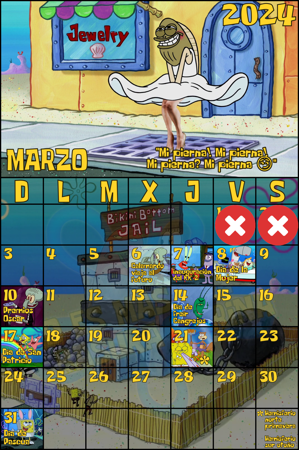

  
&fontSize=50&animation=fadeIn&fontAlignY=28&desc=I'm%20Francisco,%20a%20Mechatronics%20Engineer%20coding%20for%20fun.&descAlignY=55&descAlign=60)

## Spotify Playing :headphones:

## Spongebob Calendar

Look at this pretty calendar styled by [No es Más Que Basura Marina](https://www.facebook.com/BasuraMarina/):

## Thanks 4 watching visitor number:

  

  

